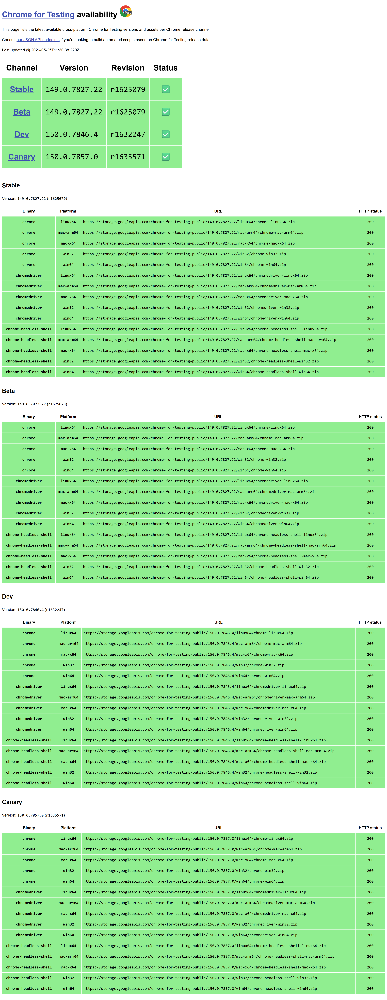
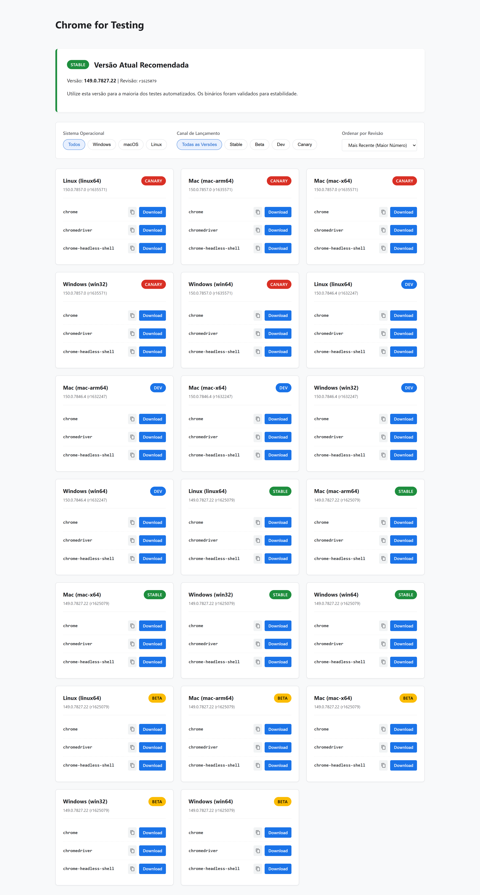

## Comparativo Visual (Antes e Depois)

### Como era (Problema)
Interface original baseada em tabelas contínuas, causando alta carga cognitiva, lentidão na busca e exigindo cópia manual de URLs longas.

### Como ficou (Solução)
Interface refatorada baseada em cards lógicos, filtros inteligentes e botões de ação clara (*affordance*).

## Melhorias de UX/UI Aplicadas

1. **Visibilidade do Status do Sistema (Heurísticas de Nielsen):**
   - Substituição de texto simples por *Badges* coloridas (Verde para Stable, Vermelho para Canary, etc.).
   - Destaque da versão recomendada no topo (Hero Section), facilitando a identificação pré-atentiva.

2. **Affordance e Prevenção de Erros:**
   - Transformação das URLs estáticas em botões diretos de **Download**.
   - Inclusão de um botão de **Cópia Rápida** com *feedback* visual imediato ("Copiado!"), prevenindo erros de seleção de texto.

3. **Redução da Carga Cognitiva:**
   - Implementação de **Filtros Inteligentes** (Sistema Operacional, Canal e Binário) e um sistema de Ordenação. O usuário visualiza apenas as informações pertinentes à sua necessidade, eliminando a fadiga de decisão.

4. **Agrupamento Lógico (Lei da Proximidade - Gestalt):**
   - Substituição da tabela genérica por uma estrutura em **Cards**. Arquivos interdependentes (Chrome, ChromeDriver, Headless Shell) foram aproximados espacialmente para evidenciar que fazem parte de um mesmo pacote.

## Tecnologias Utilizadas
- **HTML5** Semântico
- **CSS3** (Grid Layout, Flexbox, Variáveis CSS)
- **JavaScript (Vanilla)** para manipulação do DOM e lógica de filtros em tempo real
- Fundamentos de **Design de Interação (UX/UI)**

## Como executar o projeto
1. Clone este repositório para sua máquina local.
2. Abra o arquivo `index.html` em seu navegador de preferência.
3. Navegue pelos filtros e teste as interações de cópia e download.
